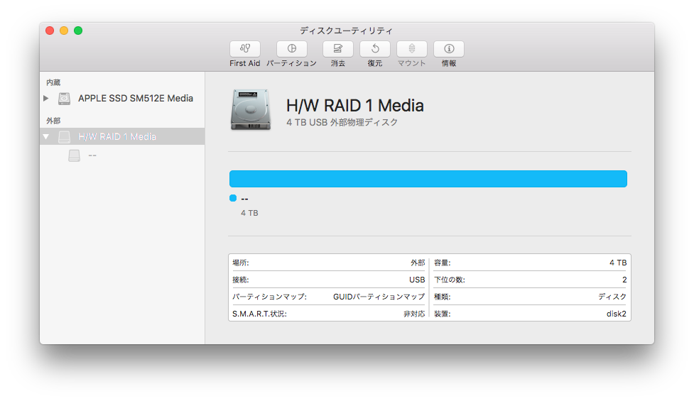
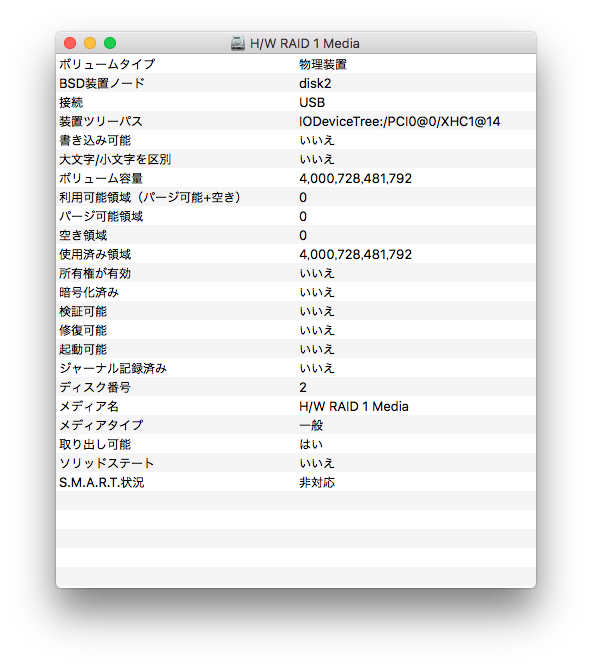
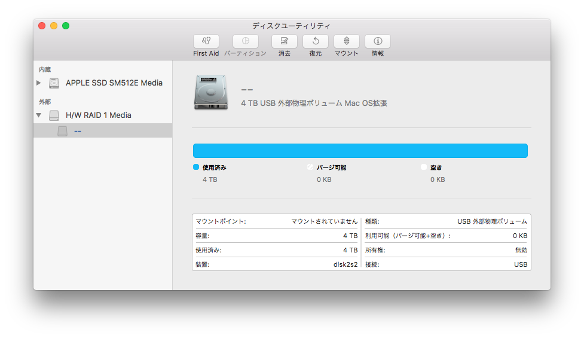
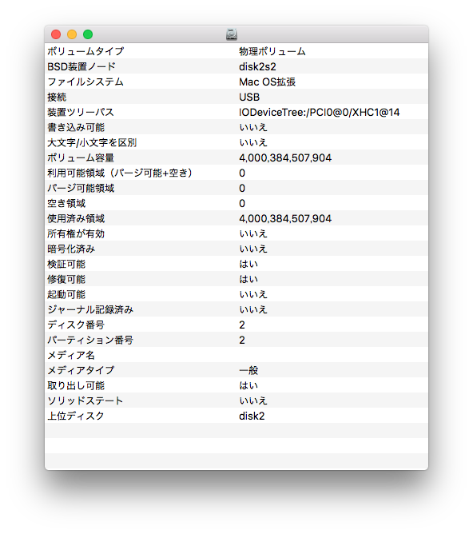

<style scoped>
@import url(http://fonts.googleapis.com/earlyaccess/notosansjp.css);
body { margin: 0 auto; padding: 2rem; box-sizing: border-box; width: 100%; max-width: 1280px; font-family: 'Noto Sans JP', sans-serif; }
p:empty { display: none; }
thead th:empty { display: none; }
.headfoot-bar { display: table; table-layout: fixed; width: 100%; color: #fff; background-color: #444;  }
.headfoot-bar p { padding: 0 1rem; display: table-cell; box-sizing: border-box; line-height: 2rem; text-align: center; }
.headfoot-bar p:first-of-type { text-align: left; }
.headfoot-bar p:last-of-type { text-align: right; }
.primary-box { padding: 1rem; background-color: #eee; } /* box-shadow: 0 1px 0 0 #ddd, inset 0 1px 0 0 #fff; */ 
.primary-box h1 { margin: 0; }
.primary-box table { margin: 1rem 0 0; width: 100%; }
.primary-box table tr:nth-child(2n+1),
.primary-box table tr:nth-child(2n+0) { background-color: #fff; }
.primary-box table td:first-child { width: 1%; white-space: nowrap; }
</style>

<div class="headfoot-bar headfoot-bar-first">
<p>2017-02-01</p>
</div>
<section class="primary-box">
# ST2-B3-6Gのディスクユーティリティでの状態
</section>

##装置

###装置のウインドウ


###装置の情報
```
ボリュームタイプ: 物理装置
BSD装置ノード: disk2
接続: USB
装置ツリーパス: IODeviceTree:/PCI0@0/XHC1@14
書き込み可能: いいえ
大文字/小文字を区別: いいえ
ボリューム容量: 4,000,728,481,792
利用可能領域（パージ可能+空き）: 0
パージ可能領域: 0
空き領域: 0
使用済み領域: 4,000,728,481,792
所有権が有効: いいえ
暗号化済み: いいえ
検証可能: いいえ
修復可能: いいえ
起動可能: いいえ
ジャーナル記録済み: いいえ
ディスク番号: 2
メディア名: H/W RAID 1 Media
メディアタイプ: 一般
取り出し可能: はい
ソリッドステート: いいえ
S.M.A.R.T.状況: 非対応
```


##ボリューム

###ボリュームのウインドウ


###ボリュームの情報
```
ボリュームタイプ: 物理ボリューム
BSD装置ノード: disk2s2
ファイルシステム: Mac OS拡張
接続: USB
装置ツリーパス: IODeviceTree:/PCI0@0/XHC1@14
書き込み可能: いいえ
大文字/小文字を区別: いいえ
ボリューム容量: 4,000,384,507,904
利用可能領域（パージ可能+空き）: 0
パージ可能領域: 0
空き領域: 0
使用済み領域: 4,000,384,507,904
所有権が有効: いいえ
暗号化済み: いいえ
検証可能: はい
修復可能: はい
起動可能: いいえ
ジャーナル記録済み: いいえ
ディスク番号: 2
パーティション番号: 2
メディア名: 
メディアタイプ: 一般
取り出し可能: はい
ソリッドステート: いいえ
上位ディスク: disk2
```

